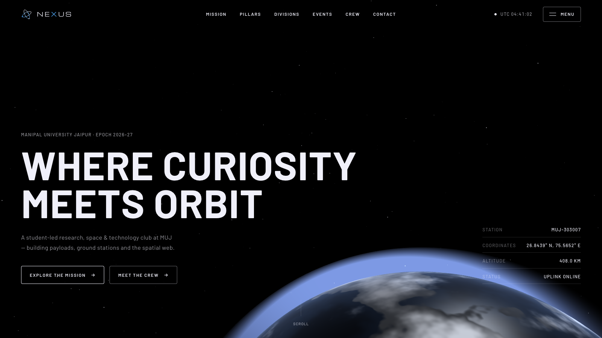
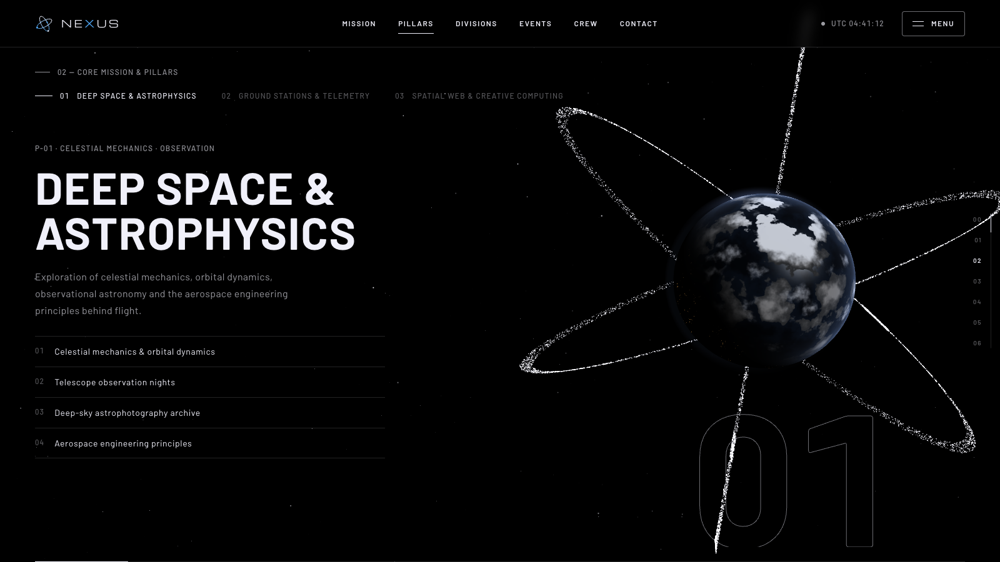
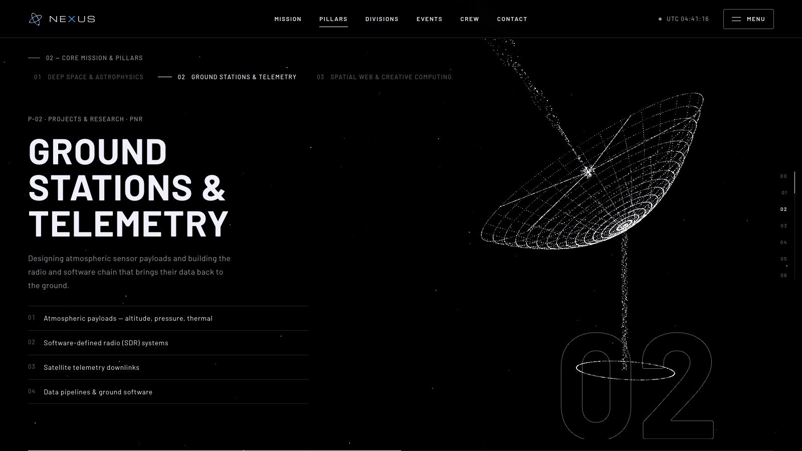
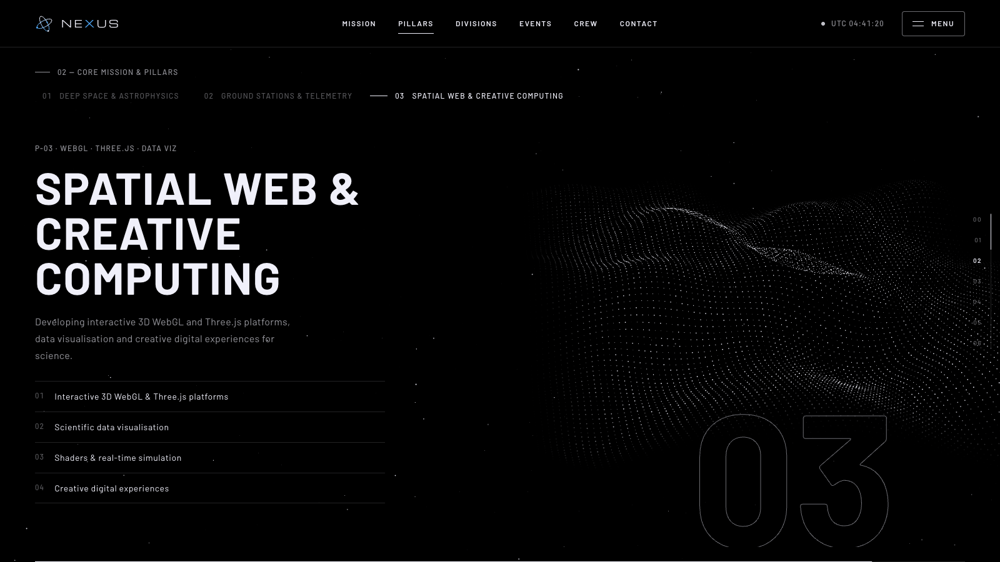
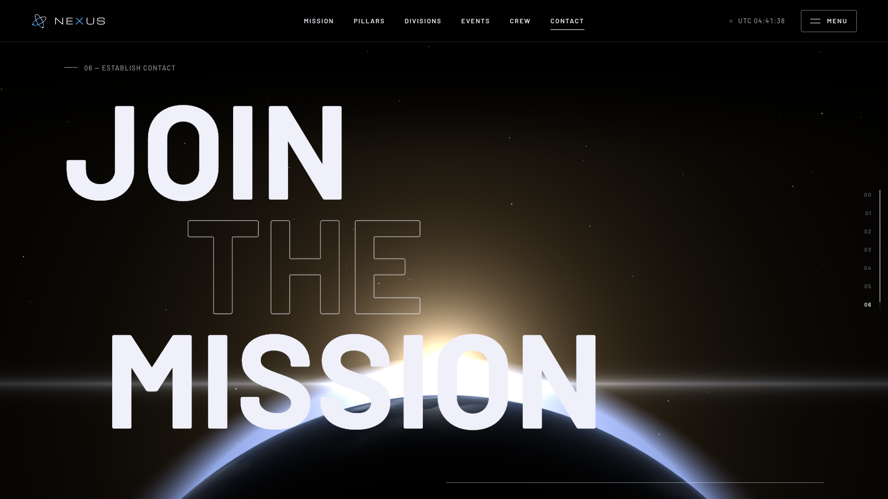
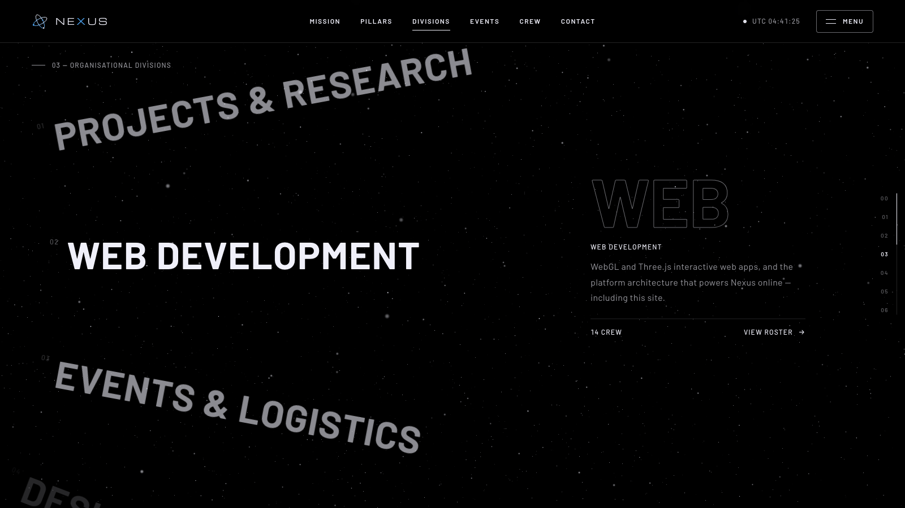
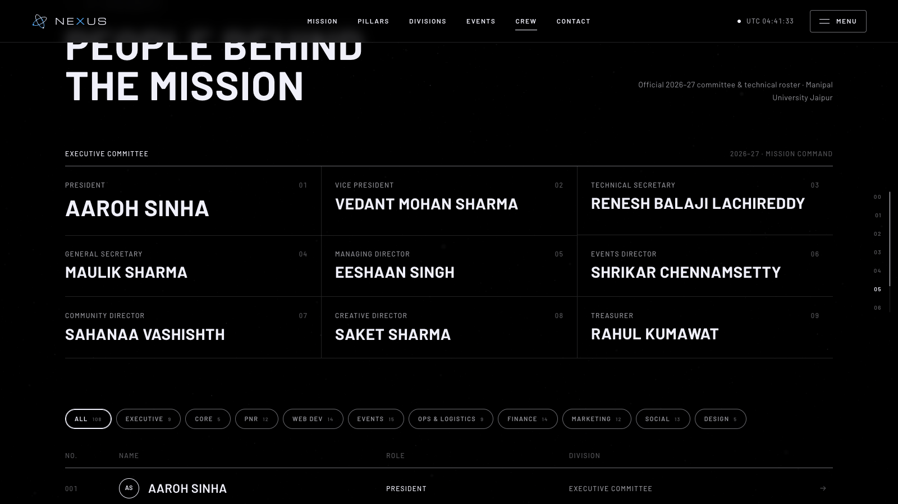
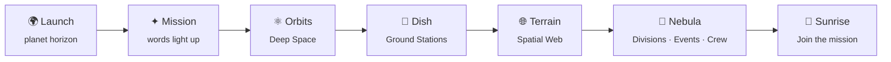
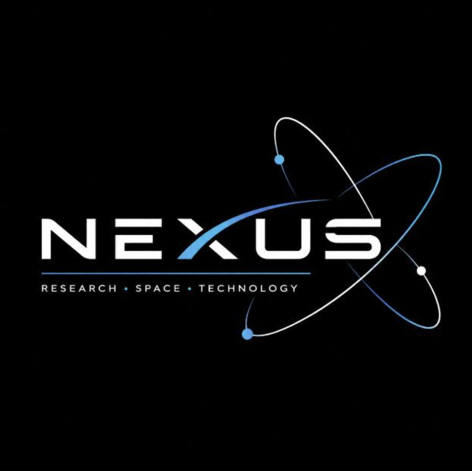

<div align="center">

<a href="https://nexus-official-site.vercel.app">
  
</a>

<br />

<a href="https://nexus-official-site.vercel.app">
  
</a>

<p>
  <b>The official website of Nexus, the Research, Space &amp; Technology Club at Manipal University Jaipur.</b><br />
  <sub>A real-time WebGL journey from low orbit to a ground station and back, built by the Nexus Web Development wing.</sub>
</p>

<p>
  <a href="https://nexus-official-site.vercel.app"></a>
</p>

<p>
  
  
  
  
  
  
</p>

<p>
  <a href="#-the-experience"><b>Experience</b></a> ·
  <a href="#-quick-start"><b>Quick start</b></a> ·
  <a href="#-updating-content"><b>Update content</b></a> ·
  <a href="#-under-the-hood"><b>Under the hood</b></a> ·
  <a href="#-design-system"><b>Design system</b></a> ·
  <a href="#-core-builders"><b>Builders</b></a> ·
  <a href="#-contributing"><b>Contribute</b></a>
</p>


</div>

## 🛰️ About Nexus

**Nexus** (formally the *Nexus Research, Space & Technology Club*) is a student-led technical and research organisation at **Manipal University Jaipur**, under the **Directorate of Student Welfare**. It gives students curious about space science, aerospace engineering, computational physics and modern software a place to build things together, with their hands.

| | Pillar | What we do |
| :---: | :--- | :--- |
| 🔭 | **Deep Space & Astrophysics** | Celestial mechanics, orbital dynamics, telescope observation nights and a deep-sky astrophotography archive. |
| 📡 | **Ground Stations & Telemetry** *(PNR)* | Atmospheric sensor payloads (altitude, pressure, thermal), software-defined radio, satellite downlinks and data pipelines. |
| 🌐 | **Spatial Web & Creative Computing** | Interactive 3D WebGL & Three.js platforms, data visualisation and creative digital experiences. |

<div align="center"></div>

## ✨ The Experience

The whole page is one continuous, scroll-driven 3D scene. A single WebGL canvas sits behind the content, and as you scroll, a **9,216-particle system** reshapes itself into each part of the Nexus story.

<table>
  <tr>
    <td width="50%"><br /><sub><b>01 · Deep Space</b>: particles form the Nexus atom orbits around a procedural planet.</sub></td>
    <td width="50%"><br /><sub><b>02 · Ground Stations</b>: they rebuild into a radio dish, sending a pulsing telemetry beam.</sub></td>
  </tr>
  <tr>
    <td width="50%"><br /><sub><b>03 · Spatial Web</b>: they ripple into a living data terrain driven by noise.</sub></td>
    <td width="50%"><br /><sub><b>06 · Join the mission</b>: the planet returns for a sunrise over its limb.</sub></td>
  </tr>
  <tr>
    <td width="50%"><br /><sub><b>Divisions</b>: a curved, scroll-driven wheel of the five wings, linked to the roster.</sub></td>
    <td width="50%"><br /><sub><b>Crew manifest</b>: the 2026–27 executive committee plus a filterable roster of 108 members.</sub></td>
  </tr>
</table>



<details>
<summary><b>🎬 Every motion detail, section by section</b></summary>
<br />

| Section | Motion |
| :--- | :--- |
| **Loader** | Uplink count from 000 to 100, a scrambled status readout, then a curtain reveal |
| **Hero** | Headline characters rise in, the planet ascends, and the readouts include a live UTC clock and an altitude figure that climbs as you scroll |
| **Mission** | The statement brightens word by word as you scroll, then counters tick up |
| **Pillars** | A pinned three-chapter sequence with an index, an outlined numeral and a progress line. The particles morph between shapes |
| **Domains** | A spec sheet with thin dividers above a data-terrain floor |
| **Divisions** | A pinned wheel that rotates the five wings along an arc |
| **Events** | A pinned horizontal track of event formats, each with generated line art |
| **Marquee** | Speeds up with your scroll and reverses with scroll direction |
| **Crew** | Division filters, plus names that scramble on hover |
| **Everywhere** | Lenis smooth scroll, a crosshair cursor, labels that decode as they appear, a sector rail and a full-screen menu |

</details>

<div align="center"></div>

## 🚀 Quick Start

> **Requires** Node.js 20+

```bash
git clone https://github.com/Nexus-Web-Development/Nexus-Web-Page.git
cd Nexus-Web-Page
npm install
npm run dev        # → http://localhost:5173
```

| Command | What it does |
| :--- | :--- |
| `npm run dev` | Starts the Vite dev server with hot reload |
| `npm run build` | Builds the production bundle into `dist/` |
| `npm run preview` | Serves the production build locally |

<div align="center"></div>

## 📝 Updating Content

**You don't need to touch any layout code.** Every word, person and link on the site comes from one file: [`src/data.js`](src/data.js).

```js
// src/data.js — add a crew member: [name, role, division]
const roster = [
  ['Aaroh Sinha', 'President', 'Executive Committee'],
  // ...
  ['New Member', 'JC', 'Web Development'],
];
```

Counts, filters, division totals and the "crew members" stat all **update automatically**.

| To change… | Edit in `src/data.js` |
| :--- | :--- |
| Executive committee, core committee, team heads, JCs | `roster` |
| The three mission pillars | `pillars` |
| Specialised domains (DOM-01 to DOM-04) | `domains` |
| The five divisions on the wheel | `divisions` |
| Event formats in the flight schedule | `formats` |
| Social and contact channels | `channels` |
| Crew filter buttons | `crewFilters` |

> [!TIP]
> Starting a new epoch? Duplicate the roster, update `site.epoch`, and push. Vercel deploys it in about 15 seconds.

<div align="center"></div>

## 🔧 Under the Hood

```
Nexus-Web-Page/
├── index.html          # Page structure, SEO & social meta
├── public/
│   ├── nexus-logo.png  # Official logo (social previews)
│   └── favicon.svg
├── src/
│   ├── data.js         # ✏️  All content: roster, pillars, divisions, channels
│   ├── scene.js        # 🪐 WebGL: shader planet, atmosphere, sunrise flare, stars, morphing particles
│   ├── main.js         # 🎬 Loader, smooth scroll, scroll→scene keyframes, pinned sections, crew, menu
│   └── style.css       # 🎨 Design tokens & responsive layout
└── vite.config.js
```

<details>
<summary><b>🪐 How the WebGL scene works</b></summary>
<br />

- **Planet:** a 160×160 sphere with a custom GLSL shader. Simplex-noise fBm generates continents, ice caps and drifting clouds. It has ocean specular, warm city lights on the night side, and a Fresnel rim, wrapped in an additive atmosphere shell that fades out from the limb.
- **Particles:** one `BufferGeometry` holds five target shapes as separate attributes (scatter, orbits, dish, terrain, nebula). The vertex shader blends between them with a per-particle stagger and adds noise turbulence while they move. Orbit and terrain positions are computed live on the GPU, so the rings spin and the terrain ripples at no CPU cost.
- **Scroll choreography:** `measureFrames()` in `main.js` pins scene states (planet position, sun direction, morph stage, opacity) to scroll positions measured from the DOM. Each frame interpolates between keyframes, and the scene eases toward the target using frame-rate-independent damping.
- **Performance:** a single renderer and draw-call-light scene, with the pixel ratio capped at 1.75. It renders frames only while the tab is visible and degrades gracefully if WebGL is unavailable.

</details>

<details>
<summary><b>♿ Accessibility & resilience</b></summary>
<br />

- Respects `prefers-reduced-motion`: native scrolling and near-instant transitions.
- Semantic landmarks, `aria` state on the menu and filters, visible focus outlines and keyboard-closable menu (<kbd>Esc</kbd>).
- The custom cursor is disabled on touch devices. The layout is fully responsive down to 375px with no horizontal scroll.
- The content is still there if the 3D scene fails; only the backdrop disappears.

</details>

<div align="center"></div>

## 🎨 Design System

A mission-control look in the style of SpaceX: **cinematic darkness, industrial type, and colour that arrives only as light.**

| Token | Value | Use |
| :--- | :--- | :--- |
|  **Void** | `#000000` | Every surface |
|  **Star White** | `#F0F0FA` | All text, icons and hairline borders |
|  **Dim Steel** | `#545457` | Muted labels and dividers |
|  **Nexus Blue** | `#4DA3F0` | **Logo only**: orbit mark, the *X* in the wordmark, footer mark |

- **Type:** *Barlow* (a D-DIN-style industrial sans) for everything. Labels are uppercase with 0.10–0.12em tracking. The wordmark is set in *Michroma*.
- **Buttons:** 1px hairline outlines with a 4px radius, never filled. The 32px pill shape is reserved for filter toggles.
- **No UI accent colour:** colour only appears as light in the 3D scene, like the planet's blue atmosphere and the warm sunrise.

<div align="center"></div>

## 👥 Core Builders

<p align="center"><i>Designed, architected and engineered by the Nexus Web Development wing: 13 builders.</i></p>

<div align="center">
<table>
  <tr>
    <td align="center" width="150">
      <a href="https://github.com/Vedant275">
        <br />
        <sub><b>Vedant Sharma</b></sub>
      </a><br />
      
    </td>
    <td align="center" width="150">
      <a href="https://github.com/Tejas-Narula">
        <br />
        <sub><b>Tejas Narula</b></sub>
      </a><br />
      
    </td>
    <td align="center" width="150">
      <a href="https://github.com/Kaustav5505g">
        <br />
        <sub><b>Kaustav Paul</b></sub>
      </a><br />
      
    </td>
    <td align="center" width="150">
      <a href="https://github.com/shaazadil">
        <br />
        <sub><b>Shaaz Adil</b></sub>
      </a><br />
      
    </td>
  </tr>
  <tr>
    <td align="center" width="150">
      <a href="https://github.com/satiricalguru">
        <br />
        <sub><b>Jatin Pandey</b></sub>
      </a><br />
      
    </td>
    <td align="center" width="150">
      <a href="https://github.com/SynthReaper">
        <br />
        <sub><b>Aditya Goyal</b></sub>
      </a><br />
      
    </td>
    <td align="center" width="150">
      <a href="https://github.com/lakshya-agrawal254">
        <br />
        <sub><b>Lakshya</b></sub>
      </a><br />
      
    </td>
    <td align="center" width="150">
      <a href="https://github.com/vs2030codes-ops">
        <br />
        <sub><b>Vansh Sood</b></sub>
      </a><br />
      
    </td>
  </tr>
  <tr>
    <td align="center" width="150">
      <a href="https://github.com/Aaravcodesss">
        <br />
        <sub><b>Aarav Srivastava</b></sub>
      </a><br />
      
    </td>
    <td align="center" width="150">
      <a href="https://github.com/Priyanshuf7">
        <br />
        <sub><b>Priyanshu</b></sub>
      </a><br />
      
    </td>
    <td align="center" width="150">
      <a href="https://github.com/saadseraj130-arch">
        <br />
        <sub><b>Saad Seraj</b></sub>
      </a><br />
      
    </td>
    <td align="center" width="150">
      <a href="https://github.com/Arnav2008">
        <br />
        <sub><b>Arnav Singh</b></sub>
      </a><br />
      
    </td>
  </tr>
  <tr>
    <td align="center" width="150">
      <a href="https://github.com/Rashmi-builds">
        <br />
        <sub><b>Rashmi</b></sub>
      </a><br />
      
    </td>
  </tr>
</table>

</div>

<div align="center"></div>

## 🤝 Contributing

We welcome developers, designers and space enthusiasts from across MUJ and the open-source community.

```bash
git checkout -b feat/your-idea           # 1. branch off main
npm run dev                              # 2. build & preview locally
npm run build                            # 3. make sure production builds
git commit -m "feat: add your idea"      # 4. use Conventional Commits
git push origin feat/your-idea           # 5. open a Pull Request
```

- Content changes go in `src/data.js`. Please keep personal details (phone numbers, registration numbers, emails) **out of the repo**.
- Follow the design system: no filled buttons, and no new accent colours.
- Check both desktop and mobile (375px) before opening a PR.

<div align="center"></div>

## 📬 Connect

<div align="center">

<a href="https://www.instagram.com/nexus_muj/"></a>
<a href="https://www.linkedin.com/company/nexus-manipal-jaipur/"></a>
<a href="mailto:nexus@jaipur.manipal.edu"></a>
<a href="https://github.com/Nexus-Web-Development"></a>

<br /><br />



<sub><b>Nexus · Research, Space &amp; Technology Club</b><br />
Academic Block 1 · Manipal University Jaipur, RJ 303007 · 26.8439° N, 75.5652° E<br />
© 2026 Nexus MUJ · Directorate of Student Welfare</sub>

</div>
